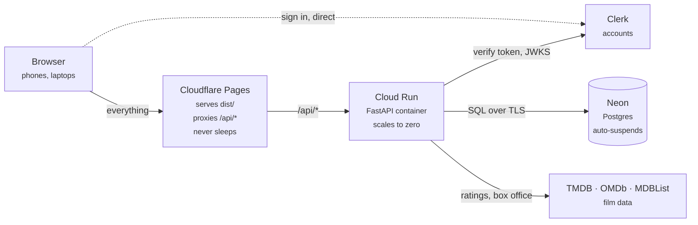
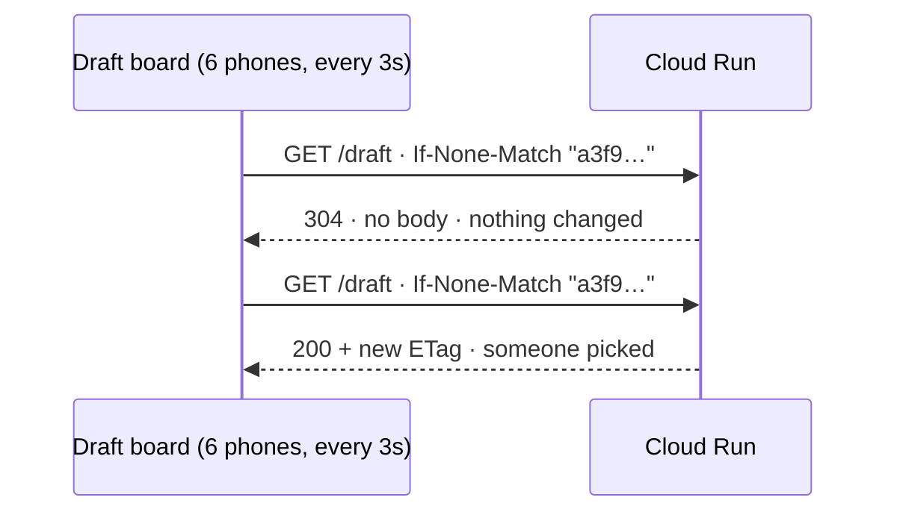

# Stage 4 — hosting

**Decided:** Cloudflare Pages for the frontend, Cloud Run for the API, Neon for the
database. Free at this size, no sleeping database, and one origin from the browser's point
of view.

The alternatives were weighed in the roadmap. What settled it: the draft polls every few
seconds from several phones, so anything that sleeps for fifty seconds is disqualified, and
the free tiers here are permanent rather than a twelve-month trial.

**Deployed 24 Aug 2026.**

| | |
|---|---|
| Site | <https://movie-league-9pp.pages.dev> |
| Pages project | `movie-league-9pp`, auto-deploys on push to `master` |
| API | <https://movie-league-244345841663.us-east5.run.app> |
| Cloud Run | project `fantasy-movie-league-506523`, service `movie-league`, region `us-east5` |
| Database | Neon, AWS `us-east-2`, at revision `a3be49610b96` |
| Accounts | Clerk development instance `simple-tomcat-1132` |
| Cost | nothing |

`us-east5` is Columbus, Ohio — the same metro as Neon's `us-east-2`, so the database
round-trip that every API call makes stays short.

Measured after deploy: **~0.3s warm**, ~0.8s on the first request after the container has
scaled to zero.

---

## How the pieces fit



**The browser talks to one origin.** Pages serves the built `dist/` and forwards `/api/*`
onward, so `api.js` keeps asking for a relative `/api` exactly as it does against the Vite
proxy in development. No code change, and no CORS preflight anywhere.

The dashed line is the one exception. Sign-in goes from the browser straight to Clerk and
never touches the API, which is why a sleeping Cloud Run cannot break signing in.

## Why the draft stays inside the free tier



A ninety-minute draft with six people is roughly **11,000 requests**, against a free
allowance in the region of two million a month. Almost all of them take the 304 path: no
body, almost no CPU. Ten drafts a month would still leave the allowance barely touched.

## The cold start, which is the whole downside

Cloud Run and Neon both scale to zero. The first request after a quiet spell waits one to
two seconds while the container starts; every request after that is warm. It lands on
whoever opens the league list first and never during a draft, because a draft keeps the
container busy.

---

## What to set up, in this order

The order matters: each step produces something the next one needs.

### 1. Neon

1. Create a project at [neon.tech](https://neon.tech), region nearest you.
2. Copy the connection string.
3. **Change the scheme** from `postgresql://` to `postgresql+psycopg://` — SQLAlchemy picks
   its driver from that prefix, and the bare form reaches for psycopg2, which is not
   installed.

### 2. Apply the schema, once, from your laptop

Before anything is deployed, and never from inside the container:

```bash
cd backend
DATABASE_URL='postgresql+psycopg://…neon.tech/…' .venv/bin/python -m alembic upgrade head
```

Cloud Run can start several instances at once, and several `alembic upgrade head` racing on
one database is how a schema ends up half-applied.

### 3. Clerk

1. In the Clerk dashboard, copy the **Frontend API URL** — that is `CLERK_ISSUER`.
2. Copy the **Publishable key** — that is `VITE_CLERK_PUBLISHABLE_KEY`.

A development instance works on any origin and is fine for a friend group. A production
instance wants a custom domain, which is the main argument for buying one.

### 4. Cloud Run

```bash
gcloud run deploy movie-league \
  --source backend \
  --region us-east5 \
  --allow-unauthenticated \
  --min-instances 0 \
  --max-instances 2
```

`--min-instances 0` is what keeps the bill at zero; setting it to 1 buys away the cold start
and starts the meter. `--max-instances 2` is a ceiling on surprises, not a capacity plan.

Then set the configuration:

```bash
cd backend && set -a && source .env && set +a
gcloud run services update movie-league --region us-east5 \
  --set-env-vars "^##^CLERK_ISSUER=$CLERK_ISSUER##TMDB_API_KEY=$TMDB_API_KEY##OMDB_API_KEY=$OMDB_API_KEY##MDBLIST_API_KEY=$MDBLIST_API_KEY##DATABASE_URL=postgresql+psycopg://…"
```

**The `^##^` prefix is not decoration.** It tells gcloud to split pairs on `##` instead of
commas. The default cost an hour on the first attempt: a Neon URL contains an `@` between
password and host, so a `^@^` delimiter split the connection string in half. The service
came up healthy — `/api/health` returned 200 — and every database route 500'd, because
`DATABASE_URL` had lost its host and a junk variable named after the host had appeared
beside it. Pick a delimiter that appears in none of the values.

Copy the service URL it prints. That is `API_ORIGIN` for the next step.

### 5. Cloudflare Pages

1. Pages → connect to Git → this repository.
2. **Root directory** `frontend`, build command `npm run build`, output directory `dist`.
3. Environment variables:
   - `API_ORIGIN` — the Cloud Run URL, no trailing slash
   - `VITE_CLERK_PUBLISHABLE_KEY`
   - `VITE_STRIPE_TIP_URL` if you want the tip jar
4. Deploy, then put the resulting `*.pages.dev` URL into Cloud Run's `CORS_ORIGIN`.

Two notes from doing it. `*.pages.dev` names are global, and `movie-league` was already
taken by a stranger, so the project became `movie-league-9pp` — check the URL Cloudflare
gives you rather than assuming it matches the project name. And each deployment also gets
its own `<hash>.movie-league-9pp.pages.dev`; `CORS_ORIGIN` wants the stable alias without
the hash.

### 6. Nightly enrichment, when you want it

Cloud Scheduler, three jobs free, one HTTP call to
`POST /api/leagues/{id}/enrich-all`. Needs a token, so it wants a service identity rather
than a bare cron.

---

## Where each setting lives

Build-time and runtime are not interchangeable, and confusing them is the most common way
this goes wrong. Anything named `VITE_*` is **baked into the bundle when Pages builds it** —
setting one on Cloud Run does nothing at all.

| Setting | Value | Set on |
|---|---|---|
| `DATABASE_URL` | Neon, with the `+psycopg` scheme | Cloud Run secret |
| `CLERK_ISSUER` | Clerk Frontend API URL | Cloud Run env |
| `CORS_ORIGIN` | The Pages URL | Cloud Run env |
| `TMDB_API_KEY`, `OMDB_API_KEY`, `MDBLIST_API_KEY` | provider keys | Cloud Run secret |
| `API_ORIGIN` | The Cloud Run URL | Pages env |
| `VITE_CLERK_PUBLISHABLE_KEY` | `pk_…` | Pages **build** env |
| `VITE_STRIPE_TIP_URL` | Stripe Payment Link | Pages **build** env |

---

## Two things that will bite

**The container refuses to start without Clerk.** `auth._assert_local_mode_is_safe` will not
boot without an identity provider if either the database or the CORS origin looks like a
deployment. Here both are true, so deploying before `CLERK_ISSUER` is set is a crash loop
rather than an app:

```
Refusing to start: no identity provider is configured, so every request would be
treated as the same single local user, but DATABASE_URL is not SQLite and
CORS_ORIGIN is not a localhost origin.
```

That is the guard working. The alternative was an internet-facing app where every visitor is
the trusted local user.

**Migrate before the first boot, not after.** `init_db()` now returns immediately on
anything but SQLite, so the container will not build a schema behind Alembic's back — but
that means an unmigrated Neon database gives you a container that starts happily and fails
on its first query.

---

## Already prepared in the repo

- `backend/Dockerfile` and `.dockerignore` — listens on `$PORT`, runs uvicorn as PID 1 so
  deploys do not wait out the kill timeout, and does not run migrations.
- `backend/requirements.txt` — `psycopg[binary]` is back, having gone out with PR #16.
- `backend/app/db/session.py` — `init_db()` is SQLite-only, per above.
- `frontend/functions/api/[[path]].js` — the Pages Function that makes everything one
  origin. A `_redirects` rule cannot do this: its 200 rewrites resolve within the site, and
  reaching another host needs a Function.

## What the first deploy proved

Nothing had ever run this application on Postgres — every test, the smoke test and the
browser tests are all SQLite. So the deploy was an experiment, and these are its results.

A whole season driven through the repo layer against Neon, then deleted: create, snake
draft over six picks, `draft_state` reporting complete, a watch scoring +5 through the
leaderboard aggregation, `uq_film_per_league` rejecting a duplicate, the archive carrying
every pick number, and `delete_league` cascading with zero orphan rows. On SQLite that last
one needs `PRAGMA foreign_keys=ON` per connection; Postgres enforces it in the engine.
Different mechanism, same result.

Then the same thing through the live stack, anonymously, browser to database and back:

```
/api/leagues                 200   the league, with players and pick counts
/api/leagues/{id}/draft      200   drafting · 3/6 picks · Cal on the clock
ETag                               W/"ed2c994367fcc4f50be03aee112e70b2"
If-None-Match                304
```

**That 304 is the one worth checking.** The Pages Function forwards `If-None-Match` and
returns the 304 untouched, so the conditional polling survives the extra hop — which is
what keeps a draft inside the free tier rather than merely near it.

Authorization holds in production too: an unauthenticated create is refused with
`Sign in to do that.`, and a forged token is rejected against the live JWKS rather than
waved through.

---

## What the platform gives us that we are not using

Connecting the repo to Pages switched several things on at once. One of them has a
consequence worth knowing about, and the rest are cheap wins sitting unclaimed.

### Preview deployments are already live, and they read production

Every pull request now builds its own deployment, reachable at a per-commit URL and at a
stable `<branch>.movie-league-9pp.pages.dev` alias. That is genuinely useful — a reviewer
can click the change rather than imagine it.

It also means **every open pull request is another public front door to the production
database.** Confirmed rather than assumed: the preview for the branch that wrote this
document served the real 2027 league, because Preview inherits `API_ORIGIN` from the
project and therefore points at the same Cloud Run and the same Neon.

Nothing is leaking today — that league is public, and mutations still need a Clerk session.
The problem is the shape: a branch carrying a destructive bug can write to the real
database from a URL nobody is watching, and preview URLs are not secret.

Two fixes, in increasing order of cost.

1. **Cloudflare Access on preview deployments.** Zero Trust is free at this size, and Pages
   has a one-click toggle to require a login on previews only. Minutes of work, and it
   closes the front door without changing anything else.

2. **A separate preview stack.** Point Preview's `API_ORIGIN` at a second Cloud Run service
   whose `DATABASE_URL` is a **Neon branch** rather than the main database. Neon branching
   is copy-on-write and instant, and the free tier includes several.

The second is the better answer, and it is the same question that came up before hosting
existed: where should test data live. The conclusion then was a separate database rather
than separate tables, and this is that conclusion with the platform doing the work — a pull
request gets a full isolated stack, seeded with a copy of real data, thrown away on merge.
It pairs with the Postgres CI job, which landed in PR #26.

### Build watch paths

A backend-only or docs-only pull request currently rebuilds the frontend for nothing. Pages
settings → **Build watch paths** → `frontend/*` stops that. The free tier's 500 builds a
month is not the constraint; the constraint is how long a reviewer waits and how much noise
a green tick is worth.

### Rollback, written down before it is needed

Pages keeps every deployment and can promote an older one instantly — no revert commit, no
rebuild. Cloud Run has the same thing in revisions:

```bash
gcloud run revisions list --service movie-league --region us-east5
gcloud run services update-traffic movie-league --region us-east5 --to-revisions <revision>=100
```

That is the incident procedure for both halves. Worth rehearsing once while nothing is
wrong.

### Web Analytics

Free, cookie-less, no consent banner needed. For a league app the only metric that matters
is whether anyone opens it between drafts, and nothing currently answers that.

### Deploy hooks

A webhook URL that triggers a Pages build. Not needed yet; the one plausible use is
rebuilding after scheduled enrichment changes the data, and that only matters if the site
ever renders anything at build time. Today it does not.

---

## Deliberately not done

**No CI deploy step.** Cloudflare Pages already deploys on push once connected. Cloud Run
should stay manual until the first few deploys have been watched by a human.

**Postgres is now covered in CI**, as of PR #26. A Postgres 16 service container runs the
whole suite on every pull request, then applies the migrations to an empty database and
diffs the result against the models. The container dies with the runner, so CI still never
touches Neon.

The smoke and browser tiers stay on SQLite deliberately. They boot a real server in
local-identity mode, which `auth._assert_local_mode_is_safe` refuses against a non-SQLite
database — correctly. What Postgres changes is SQL generation and types; what those tiers
test is HTTP and UI wiring.
